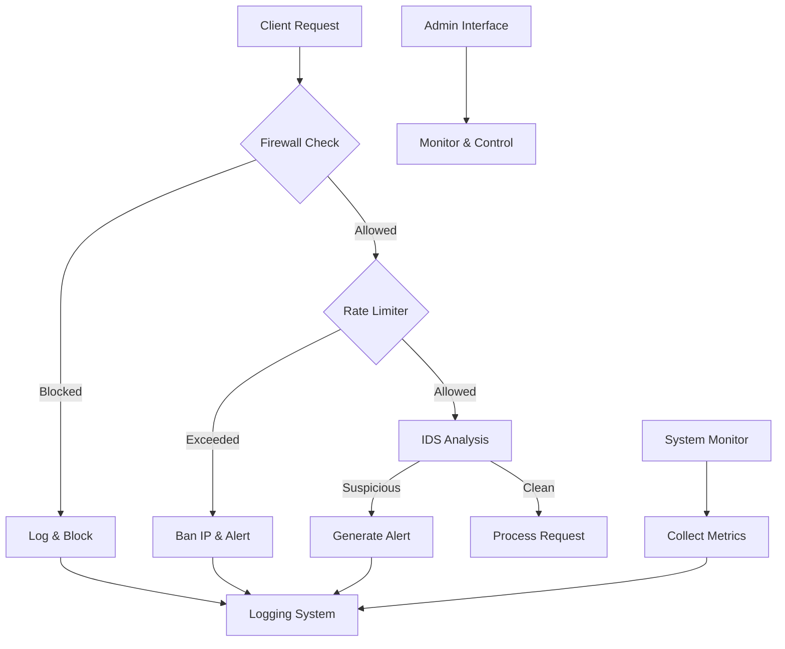

# comprehensive-server-protection-shield-application-in-Python-with-multiple-security-layers

**Advanced Python-based security application for server protection**  
*A comprehensive security suite featuring firewall, intrusion detection, rate limiting, and real-time monitoring*

[](https://www.python.org/)
[](LICENSE)
[](https://www.python.org/dev/peps/pep-0008/)


## ✨ Features

### 🔥 Core Security Features
- **🛡️ Intelligent Firewall** - Stateful packet inspection with dynamic whitelist/blacklist management
- **⚡ Rate Limiting** - Advanced DDoS protection with automatic IP banning
- **🚨 Intrusion Detection** - Real-time detection of port scans and suspicious activities
- **📊 System Monitoring** - Continuous monitoring of CPU, memory, and network connections
- **📝 Comprehensive Logging** - Detailed security logs with alert system


### 🎯 Additional Capabilities
- 🌐 **Web Admin Interface** - Real-time dashboard for monitoring and management
- 🔄 **Auto-Blacklisting** - Intelligent IP banning based on threat patterns
- 📈 **Performance Stats** - Detailed metrics and analytics
- ⚙️ **Configurable Rules** - JSON-based configuration for easy customization
- 🔌 **Modular Architecture** - Easy to extend with new security modules

## 📦 Installation

### Prerequisites
- Python 3.8 or higher
- Linux/Unix-based system (recommended)
- Root/sudo privileges for full functionality

### Quick Installation
```bash
# Clone the repository
git clone https://github.com/yourusername/server-protection-shield.git
cd server-protection-shield

# Install dependencies
pip install -r requirements.txt

# Make script executable
chmod +x server_shield.py

# Create configuration files
touch firewall_rules.json blacklist.json
```

### Docker Installation (Coming Soon)
```bash
docker pull yourusername/server-shield:latest
docker run -d --name shield --net=host yourusername/server-shield
```

## 🚀 Quick Start

### Basic Usage
```bash
# Start with default settings
sudo ./server_shield.py --start

# Check status
./server_shield.py --status

# View real-time dashboard
# Open browser: http://localhost:8888
```

### Command Line Interface
```bash
# Start the protection shield
sudo ./server_shield.py --start

# Add IP to blacklist
sudo ./server_shield.py --blacklist 192.168.1.100 --reason "Suspicious activity"

# Remove IP from blacklist
sudo ./server_shield.py --unblock 192.168.1.100

# View alerts
./server_shield.py --view-alerts

# Show statistics
./server_shield.py --stats

# View help
./server_shield.py --help
```

## 🎛️ Configuration

### Configuration File (`config.py` or modify directly in script)
```python
class Config:
    # Network settings
    LISTEN_IP = '0.0.0.0'
    MONITOR_PORT = 9999
    ADMIN_PORT = 8888
    
    # Protection thresholds
    MAX_CONNECTIONS_PER_IP = 100
    BAN_THRESHOLD = 50      # Requests per minute
    BAN_DURATION = 3600     # 1 hour in seconds
    
    # Detection settings
    PORT_SCAN_THRESHOLD = 10
    SYN_FLOOD_THRESHOLD = 100
    
    # Logging
    LOG_FILE = 'security_shield.log'
    ALERT_FILE = 'security_alerts.log'
```

### Firewall Rules (`firewall_rules.json`)
```json
[
    {
        "action": "allow",
        "src": "any",
        "dst": "any",
        "port": "80,443",
        "protocol": "tcp",
        "description": "Allow HTTP/HTTPS"
    },
    {
        "action": "allow",
        "src": "192.168.1.0/24",
        "dst": "any",
        "port": "22",
        "protocol": "tcp",
        "description": "Allow SSH from local network"
    },
    {
        "action": "deny",
        "src": "any",
        "dst": "any",
        "port": "any",
        "protocol": "any",
        "description": "Default deny rule"
    }
]
```

## 🌐 Web Dashboard

Access the admin dashboard at `http://your-server-ip:8888`

### Dashboard Features
- 📊 **Real-time Statistics** - Request counts, blocked attempts, active threats
- 📋 **Blacklist Management** - View and manage blocked IPs
- 🚨 **Alert Viewer** - Recent security alerts with timestamps
- 📈 **System Metrics** - CPU, memory, and network usage
- ⚡ **Quick Actions** - Manual IP blocking/unblocking


## 🏗️ Architecture



### Core Components
1. **Firewall Module** - Rule-based packet filtering
2. **Rate Limiter** - Request throttling and DDoS protection
3. **IDS Engine** - Pattern-based intrusion detection
4. **System Monitor** - Resource usage tracking
5. **Logging System** - Centralized logging and alerts
6. **Admin Interface** - Web-based management

## 🔧 Advanced Configuration

### Custom Detection Rules
```python
# Add custom detection logic in IntrusionDetectionSystem class
def detect_custom_pattern(self, packet_data):
    """Example: Detect SQL injection patterns"""
    sql_patterns = [
        r"SELECT.*FROM",
        r"UNION.*SELECT",
        r"INSERT.*INTO",
        r"DROP.*TABLE"
    ]
    
    for pattern in sql_patterns:
        if re.search(pattern, packet_data, re.IGNORECASE):
            return True
    return False
```

### Integration with External Services
```python
# Example: Integrate with AbuseIPDB
def report_to_abuseipdb(self, ip_address, categories, comment=""):
    """Report malicious IP to AbuseIPDB"""
    import requests
    
    url = "https://api.abuseipdb.com/api/v2/report"
    headers = {
        "Key": os.getenv("ABUSEIPDB_API_KEY"),
        "Accept": "application/json"
    }
    
    data = {
        "ip": ip_address,
        "categories": categories,
        "comment": comment
    }
    
    response = requests.post(url, headers=headers, data=data)
    return response.json()
```

## 📊 Performance Metrics

The shield provides comprehensive metrics:

| Metric | Description | Default Threshold |
|--------|-------------|-------------------|
| Request Rate | Requests per minute per IP | 50 |
| Port Scan | Unique ports per IP | 10 |
| SYN Flood | SYN packets per second | 100 |
| Memory Usage | System memory utilization | 90% |
| CPU Usage | System CPU utilization | 80% |

## 🚨 Alert Examples

### Sample Alert Log
```
2024-01-15 14:30:25 - ALERT - DDoS Alert: IP 203.0.113.5 exceeded rate limit (75 requests/min)
2024-01-15 14:31:10 - ALERT - PORT_SCAN detected from 198.51.100.23 to 15 different ports
2024-01-15 14:32:45 - ALERT - IP 192.0.2.100 added to blacklist: Suspicious activity
2024-01-15 14:35:20 - ALERT - High memory usage: 92.5%
```

### Alert Severity Levels
- 🔵 **INFO** - Normal operational messages
- 🟡 **WARNING** - Potential security concerns
- 🟠 **ALERT** - Security events requiring attention
- 🔴 **CRITICAL** - Immediate action required

## 🤝 Contributing

We welcome contributions! Here's how you can help:

1. **Fork** the repository
2. **Create** a feature branch (`git checkout -b feature/AmazingFeature`)
3. **Commit** your changes (`git commit -m 'Add some AmazingFeature'`)
4. **Push** to the branch (`git push origin feature/AmazingFeature`)
5. **Open** a Pull Request

### Development Setup
```bash
# Set up development environment
python -m venv venv
source venv/bin/activate  # On Windows: venv\Scripts\activate
pip install -r requirements-dev.txt

# Run tests
python -m pytest tests/

# Check code style
flake8 server_shield.py
```

### Project Structure
```
server-protection-shield/
├── server_shield.py      # Main application
├── requirements.txt      # Dependencies
├── firewall_rules.json   # Firewall configuration
├── blacklist.json        # Blacklisted IPs
├── security_shield.log   # Application logs
├── security_alerts.log   # Security alerts
├── tests/               # Test files
└── docs/                # Documentation
```

## 📚 Documentation

- [API Documentation](docs/API.md) - Detailed API reference
- [Configuration Guide](docs/CONFIGURATION.md) - Complete configuration options
- [Deployment Guide](docs/DEPLOYMENT.md) - Production deployment instructions
- [Troubleshooting](docs/TROUBLESHOOTING.md) - Common issues and solutions

## 🛡️ Security Best Practices

### Recommended Deployment
1. **Run as non-root user** when possible
2. **Use fail2ban** in conjunction with this shield
3. **Regularly update** blacklists and rules
4. **Monitor logs** daily for unusual activity
5. **Backup configurations** regularly
6. **Use HTTPS** for admin interface in production

### Integration with Other Tools
```bash
# Example: Integrate with fail2ban
[server-shield]
enabled = true
filter = server-shield
action = iptables-allports
logpath = /path/to/security_alerts.log
maxretry = 3
bantime = 86400
```

## 📈 Benchmarks

| Feature | Performance Impact | Resource Usage |
|---------|-------------------|----------------|
| Firewall Rules | < 1ms per packet | Low memory |
| Rate Limiting | < 2ms per request | Medium memory |
| IDS Analysis | 3-5ms per packet | High CPU |
| System Monitoring | 1% CPU overhead | Low memory |

## 🚧 Roadmap

### Planned Features
- [ ] **Machine Learning** - AI-based threat detection
- [ ] **GeoIP Blocking** - Country-based filtering
- [ ] **Cloud Integration** - AWS/Azure/GCP support
- [ ] **Mobile App** - Remote monitoring
- [ ] **API Security** - REST API protection
- [ ] **Container Security** - Docker/Kubernetes support

### In Development
- ✅ **Web Dashboard** - Basic interface
- 🔄 **Plugin System** - Extensible architecture
- ⏳ **REST API** - Programmatic control

## 📄 License

This project is licensed under the MIT License - see the [LICENSE](LICENSE) file for details.

## 🙏 Acknowledgments

- Inspired by various open-source security tools
- Thanks to all contributors and testers
- Built with security best practices in mind

## 📬 Contact

Om Gedam

GitHub: @itsomg134

Email: omgedam123098@gmail.com

Twitter (X): @omgedam

LinkedIn: Om Gedam

Portfolio: https://ogworks.lovable.app
